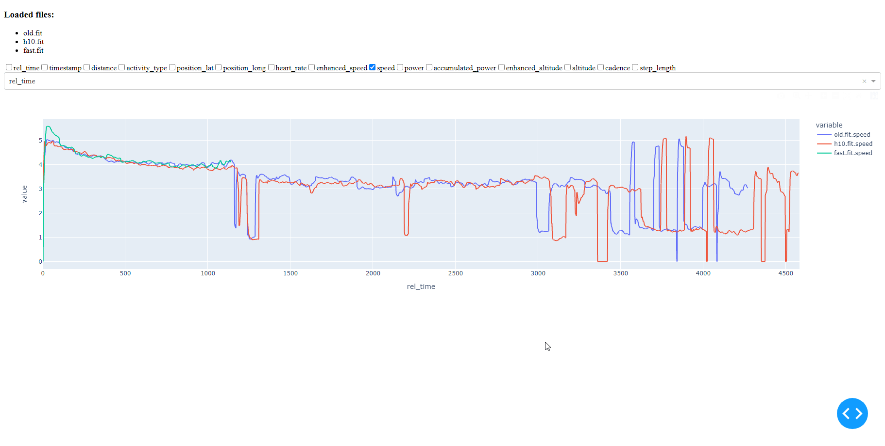

# Summary

I do a lot of the same routes for run training so I can see my progress along that route. Most run analysis apps will show you how you did on one run but they won't have an easy way for you to compare multiple runs. 

I'm building this small python app to allow anyone with the technical know-how to run their own workout charting and analysis application!

# Requirements

* `python3`

# Pre-req Installation

`pip install -r requirements.txt`

# Usage

Input files should be [FIT](https://developer.garmin.com/fit/protocol/) files.

`python3 run.py --files 1.fit 2.fit 3.fit`

When you see that the server has started, go to `http://localhost:8050`

## Modifications

Modify `run.py` at your convenience to serve the website along another port or whatever you want

# v0.1 GIF

> 

# TODO

So much....

* Allow you to set different colors for heart rate zones, pace zones, etc... based on a config file or default
* Allow you to shift a graph by some x or y value
* Other metrics including VO2Max, fatigue, pace
* Make the site prettier
* API connections to a variety of different wearables sites to auto-download FIT files instead of having to manually set it up
* Allow the site to ingest uploaded FIT files instead of only via cmdline
* Create a dockerized version of this application
* Show general stats
* Allow conversion of axis units (e.g., m/s to mph)
